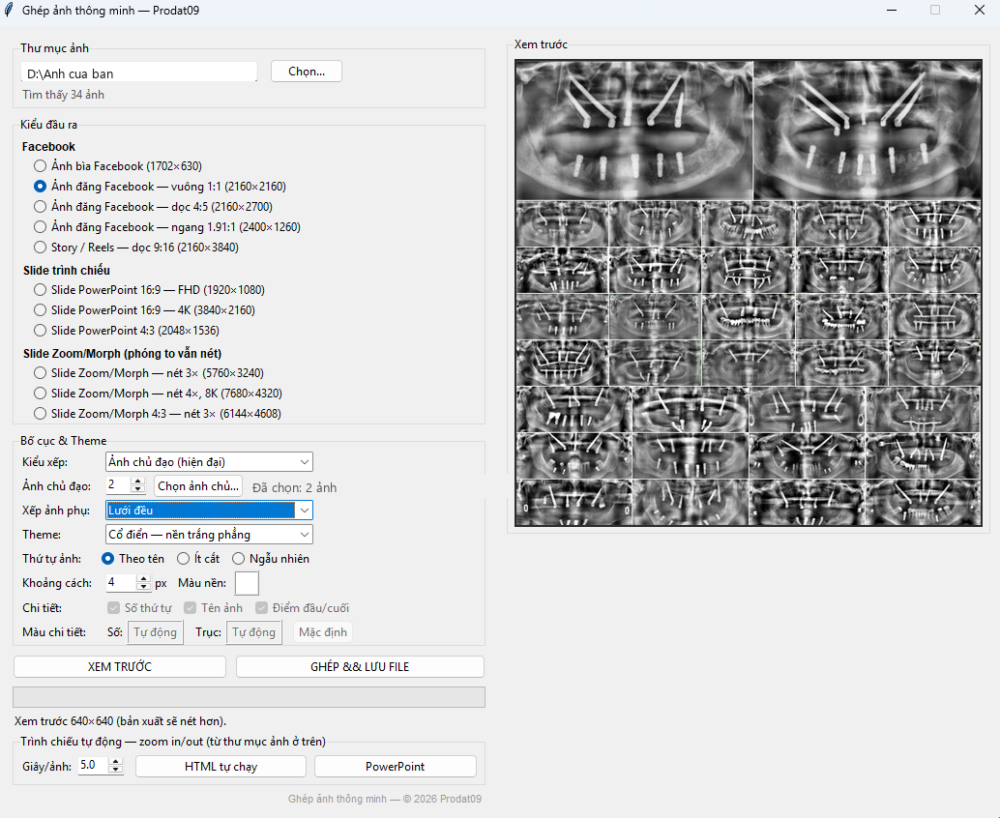

# Ghép ảnh thông minh (Smart Collage)

Phần mềm bởi **Prodat09** — © 2026.

Ghép toàn bộ ảnh trong một thư mục (1 → 300 ảnh) thành **một tấm ảnh chất lượng cao**, tự thích ứng với số lượng ảnh — không chồng chéo, không méo ảnh.

Thuật toán tham khảo kinh nghiệm từ [flickr/justified-layout](https://github.com/flickr/justified-layout), [adrienverge/PhotoCollage](https://github.com/adrienverge/PhotoCollage) và Linear Partition (Skiena).

## ⚡ Tải về & chạy ngay (không cần tải cả thư mục, không cần Python)

Chỉ cần **1 file exe** là dùng được:

1. **Tải** [GhepAnh.exe](https://github.com/tjmyou123/GhepAnh/releases/latest/download/GhepAnh.exe) (giao diện, ~35 MB) — hoặc vào tab [Releases](https://github.com/tjmyou123/GhepAnh/releases) bấm file muốn tải.
2. **Nháy đúp** `GhepAnh.exe` → chọn thư mục ảnh → chọn kiểu đầu ra / bố cục / theme (có khung xem trước) → bấm **GHÉP & LƯU FILE**. Xong!
3. Lần đầu mở nếu Windows SmartScreen hỏi: bấm **More info → Run anyway** (exe ký bằng chứng chỉ tự ký Prodat09 — muốn hết hỏi thì cài thêm [Prodat09.cer](https://github.com/tjmyou123/GhepAnh/releases/latest/download/Prodat09.cer) vào *Trusted Root + Trusted Publishers*).

Thích dùng dòng lệnh? Tải thêm [ghep.exe](https://github.com/tjmyou123/GhepAnh/releases/latest/download/ghep.exe):

```powershell
ghep.exe "D:\Anh du lich" -p fb-cover              # ghép ảnh bìa Facebook
ghep.exe "D:\Anh" -l timeline -t boardroom          # dòng thời gian kỷ niệm
ghep.exe show "D:\Anh" --pptx --title "Hè 2026"     # trình chiếu PowerPoint tự chạy
```

Giao diện thực tế — chọn thư mục là thấy ngay kết quả ở khung xem trước:



> Mọi thứ bên dưới (cài Python, clone repo…) chỉ dành cho người muốn chạy từ mã nguồn hoặc tự build.

## Kiểu đầu ra

| Preset | Mục đích | Kích thước |
|---|---|---|
| `fb-cover` | Ảnh bìa Facebook | 1702×630 |
| `fb-post` | Ảnh đăng Facebook — vuông 1:1 | 2160×2160 |
| `fb-post-doc` | Ảnh đăng Facebook — dọc 4:5 (chiếm nhiều màn hình nhất) | 2160×2700 |
| `fb-post-ngang` | Ảnh đăng Facebook — ngang 1.91:1 | 2400×1260 |
| `fb-story` | Story / Reels — dọc 9:16 | 2160×3840 |
| `ppt` | Slide PowerPoint 16:9 — FHD | 1920×1080 |
| `ppt-4k` | Slide PowerPoint 16:9 — 4K | 3840×2160 |
| `ppt-43` | Slide PowerPoint 4:3 | 2048×1536 |
| `ppt-zoom` | Slide Zoom/Morph — phóng to 3× vẫn nét | 5760×3240 |
| `ppt-zoom-4x` | Slide Zoom/Morph — phóng to 4×, 8K | 7680×4320 |
| `ppt-zoom-43` | Slide Zoom/Morph khổ 4:3 — 3× | 6144×4608 |

## Kiểu bố cục (`--layout`)

| Kiểu | Mô tả |
|---|---|
| `justified` | Hàng cân bằng tự nhiên (mặc định, ít cắt ảnh) |
| `grid` | Lưới đều — gọn gàng, hợp báo cáo |
| `mosaic` | Lưới điểm nhấn — ô to 2×2 xen kẽ ô nhỏ, hiện đại |
| `masonry` | Cột dọc kiểu Pinterest |
| `hero` | Ảnh chủ đạo kiểu tạp chí: giữ đúng tỉ lệ ảnh chủ (ảnh ngang → dải banner, ảnh dọc → cột lớn), hỗ trợ 1–6 ảnh chủ (`--heroes`) và kết hợp kiểu xếp ảnh phụ (`--hero-fill`) |
| `polaroid` | Thẻ ảnh polaroid nghiêng nhẹ, có bóng đổ |
| `stack` | Xếp nghiêng tự do kiểu "bàn ảnh" — không khung, bóng mềm |
| `timeline` | Dòng thời gian ngang — thẻ ảnh xen kẽ trên/dưới trục uốn lượn, chấm mốc đánh số, điểm xuất phát + mũi tên kết thúc, nhãn tên ảnh đối diện thẻ |
| `timeline-doc` | Timeline dọc — trục giữa mỗi cột, thẻ ảnh hai bên, chạy rắn bò xuống/lên |
| `process` | Quy trình infographic — ảnh cắt hình mũi tên chevron nối nhau, huy hiệu số bước |
| `path` | Hành trình — ảnh tròn nối bằng đường chấm, huy hiệu số kiểu bản đồ điểm dừng |
| `steps` | Bậc thang tiến bước — thẻ ảnh đặt trên bậc đi lên dần, số mốc trên mép bậc |
| `filmstrip` | Cuộn phim cổ điển — dải phim tối + lỗ răng đục xuyên nền, số khung màu cam phim |
| `string` | Dây treo ảnh vintage — dây võng nhẹ, polaroid kẹp gỗ, chú thích tên ảnh ở lề dưới |
| `hexagon` | Tổ ong lục giác — ảnh cắt lục giác viền sáng, phong cách infographic |

## Theme (`--theme`)

`classic` (trắng phẳng) · `modern-light` / `modern-dark` (gradient + bo góc + bóng đổ) · `boardroom` (navy báo cáo) · `cream` (kem ấm, hợp polaroid) · `gallery-black` (nền đen triển lãm) · `sunset` (cam hồng) · `ocean` (xanh biển) · `forest` (lục đậm) · `pastel` (hồng kem dịu)

## Cài đặt (1 lần)

```powershell
pip install -r requirements.txt
```

## Đóng gói thành file .exe (chạy không cần Python)

Không muốn tự build? Xem mục **⚡ Tải về & chạy ngay** ở đầu trang.

Tự build: nháy đúp `build_exe.bat` (hoặc chạy `python -m PyInstaller GhepAnh.spec --noconfirm --clean`). Sau 1–3 phút, exe được tạo trong `dist\` và tự copy ra thư mục gốc:

| File | Công dụng |
|---|---|
| `GhepAnh.exe` | Giao diện đồ hoạ — nháy đúp là chạy, copy sang máy khác không cần cài gì (~35 MB) |
| `ghep.exe` | Bản dòng lệnh: `ghep.exe "D:\Anh" -l timeline`, `ghep.exe show "D:\Anh" --pptx` |

Cả hai exe được **ký số bằng chứng chỉ tự ký Prodat09** (tự tạo khi build). Máy khác muốn hết cảnh báo SmartScreen: cài `packaging\Prodat09.cer` vào *Trusted Root Certification Authorities* + *Trusted Publishers*, hoặc bấm *More info → Run anyway*.

## Cách dùng

**Giao diện (khuyên dùng):** nháy đúp `GhepAnh.bat`, hoặc:

```powershell
python -m smart_collage.gui
```

Giao diện có **khung xem trước** bên phải — chỉnh preset/bố cục/theme thấy ngay kết quả trước khi bấm *GHÉP & LƯU FILE*.

**Dòng lệnh:**

```powershell
python -m smart_collage "D:\Anh du lich" -p fb-cover
python -m smart_collage "D:\Anh" -p ppt-zoom -l grid -t modern-dark   # slide zoom siêu nét
python -m smart_collage "D:\Anh" -p ppt -l polaroid -t cream          # kỷ niệm polaroid
python -m smart_collage "D:\Anh" -p ppt -l timeline -t boardroom      # dòng thời gian kỷ niệm
python -m smart_collage "D:\Anh" -p ppt -l process -t modern-dark     # quy trình mũi tên
python -m smart_collage "D:\Anh" -p ppt -l string -t cream            # dây treo ảnh vintage
python -m smart_collage "D:\Anh" -p ppt -l filmstrip -t gallery-black # cuộn phim
```

Kết quả lưu tại `collage_<preset>_<layout>_<theme>.jpg` trong thư mục ảnh; nếu trùng tên sẽ tự thêm ` (2)`, ` (3)`… — không bao giờ ghi đè (trừ khi dùng `--overwrite`).

### Tuỳ biến chi tiết infographic (timeline, process, path…)

Các layout infographic có thể bật/tắt và đổi màu từng chi tiết — trong GUI là hàng **"Chi tiết"** và **"Màu chi tiết"** (chỉ sáng khi chọn layout infographic), trong dòng lệnh:

| Tuỳ chọn | Tác dụng |
|---|---|
| `--no-numbers` | Ẩn số thứ tự (chấm mốc timeline, huy hiệu bước process/path/steps, số khung filmstrip) |
| `--no-captions` | Ẩn nhãn tên ảnh (timeline, timeline-doc, string) |
| `--no-markers` | Ẩn điểm xuất phát + mũi tên kết thúc (timeline, timeline-doc) |
| `--num-color MAU` | Màu số/huy hiệu số, vd `#E11D48` hoặc `orange` (mặc định: tự động theo nền) |
| `--line-color MAU` | Màu trục/đường nối/dây treo, vd `#0EA5E9` (mặc định: tự động theo nền) |

```powershell
# timeline tối giản: không nhãn, không mũi tên, số đỏ trên trục xanh
python -m smart_collage "D:\Anh" -l timeline --no-captions --no-markers --num-color "#E11D48" --line-color "#0EA5E9"
```

## Trình chiếu ảnh tự động — hiệu ứng zoom

Chỉ cần chọn thư mục ảnh — tự tạo trình chiếu kiểu Ken Burns: mỗi ảnh phủ kín màn hình, zoom in/out + lướt chậm xen kẽ, chuyển cảnh mờ dần, tự động chạy và lặp lại:

```powershell
python -m smart_collage show "D:\Anh du lich" --title "Kỷ niệm hè 2026" --open
python -m smart_collage show "D:\Anh" --pptx --dur 4 --zoom 15   # PowerPoint
python -m smart_collage show "D:\Anh" --all --captions --order random
```

- **HTML**: 1 file tự chạy offline — Space dừng/chạy, `←/→` chuyển tay, `F` toàn màn hình, vuốt cảm ứng, thanh tiến trình; hợp kọi TV/kốt ki-ốt.
- **PPTX**: mỗi ảnh 1 slide có hiệu ứng **zoom thật (Grow/Shrink)** + chuyển cảnh fade + **tự chuyển slide** sau N giây — mở lên là chiếu được ngay.
- Tự thêm **slide tiêu đề** (khi có `--title`) và **slide collage mở đầu** ghép toàn bộ ảnh (khi ≥ 4 ảnh, tắt bằng `--no-intro`).
- Tùy chỉnh: `--dur` giây/ảnh · `--zoom` 4–40% · `--theme` màu nền · `--captions` hiện tên file · `--no-loop` · `--size 4:3`.

Trong GUI: khung **Trình chiếu tự động — zoom in/out** dùng luôn thư mục ảnh + theme đang chọn, chỉnh được số giây/ảnh, xuất bằng 1 nút.


### Tùy chọn chính

- `-l, --layout` — kiểu bố cục (bảng trên)
- `-t, --theme` — theme trang trí (khoảng cách/lề tự chỉnh theo theme)
- `--heroes N` — số ảnh chủ đạo cho layout `hero` (1–6; ≥2 xếp thành dải lớn trên cùng)
- `--hero TEN.jpg` — chọn đích danh ảnh chủ theo tên file (lặp lại được tới 6 lần); trong giao diện dùng nút **Chọn ảnh chủ…** (có xem thử thumbnail, giữ Ctrl để chọn nhiều)
- `--hero-fill grid|masonry` — kết hợp ảnh chủ đạo với kiểu xếp khác cho ảnh phụ (mặc định hàng cân bằng)
- `--order aspect` — xếp ảnh cùng tỉ lệ vào cùng hàng (ít phải cắt ảnh nhất)
- `--margin N` / `--outer N` — khoảng cách giữa ảnh / lề ngoài (px)
- `--bg "#RRGGBB"` — màu nền (theme classic)
- `--scale 3` — tăng độ nét (siêu lấy mẫu)
- `--quality 98` — chất lượng JPEG
- `--overwrite` — ghi đè thay vì tự đánh số tên file

## Chất lượng & độ tin cậy

- Layout dạng *justified rows* + chia hàng cân bằng bằng quy hoạch động → **không thể chồng chéo** với mọi số lượng ảnh.
- Tự xoay ảnh theo EXIF, bỏ qua file hỏng (có cảnh báo), hỗ trợ jpg/png/webp/bmp/tiff/gif.
- Thu mẫu LANCZOS + siêu lấy mẫu 2× → ảnh ra sắc nét.
- Cảnh báo khi quá nhiều ảnh khiến mỗi ô quá nhỏ.
